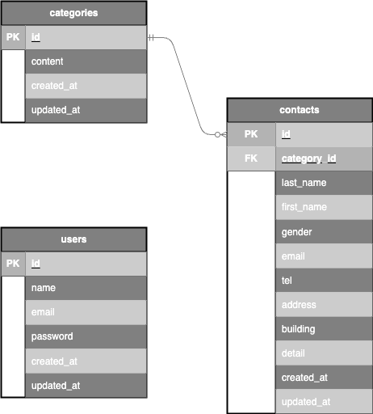

# お問い合わせ管理システム（Laravel × Docker）
ユーザーのお問い合わせを受け付けて DB に保存し、
管理者が一覧・検索できる Laravel アプリケーションです。
Docker（nginx / PHP / MySQL / phpMyAdmin）環境で動作します。

---

## アプリケーション名
お問い合わせ管理システム（Contact Management System）

---

## 環境構築
Dockerビルド
・git clone git@github.com:m-erui307/test_contact-form.git
・docker-compose up -d --build

Laravel環境構築
・docker-compose exec php bash
・composer install
・cp .env.example .env
    DB_CONNECTION=mysql
    DB_HOST=mysql
    DB_PORT=3306
    DB_DATABASE=laravel_db
    DB_USERNAME=laravel_user
    DB_PASSWORD=laravel_pass
・php artisan key:generate
・php artisan migrate
・php artisan db:seed

開発環境
・お問い合わせ画面：http://localhost/
・お問い合わせ確認画面：http://localhost/confirm
・お問い合わせ送信完了：http://localhost/thanks
・ユーザー登録：http://localhost/register
・ログイン画面：http://localhost/login
・管理画面：http://localhost/admin
    （※Laravel Fortify による認証が必要です。未ログインの場合は /login にリダイレクトされます。）
・phpMyAdmin：http://localhost:8080/

---

## 使用技術（実行環境）
・PHP 8.1.33
・Laravel 8.83.8
・MySQL 8.0.26
・nginx 1.21.1
・Docker / docker-compose 3.8
・Laravel Fortify

## ER図
